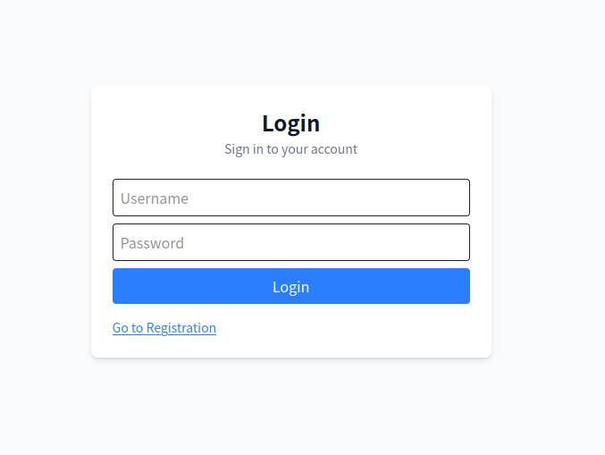

# Chilsonite Dashboard

## Overview

Chilsonite Dashboard is a frontend web application for the open‑source rotating proxy system **Chilsonite**. It provides a user‑friendly interface to:

- Manage proxy agents  
- Generate access tokens  
- Monitor system status  

This dashboard makes it easy to interact with the Chilsonite proxy system without needing to use command‑line tools or make raw API calls.

## How to Run

### Development Environment

1. **Clone the repository**  
   ```bash
   git clone https://github.com/chilsonite/chilsonite-dashboard.git
   cd chilsonite-dashboard
    ```

2. **Install dependencies**

   ```bash
   npm install
   # or
   pnpm install
   ```

3. **Start the development server**

   ```bash
    CICADA_API_URL=http://localhost:8080 npm run dev
   # or
    CICADA_API_URL=http://localhost:8080 pnpm dev
   ```

4. **Access the dashboard**
   Open your browser and navigate to:

   ```
   http://localhost:3000
   ```

### Production Deployment

> **Note:**
> The project is currently in development. Future plans include integration with the main Chilsonite repository via Docker Compose for streamlined deployment and operation of the complete system.

## How to Use

### Login & Registration Screens

* **Login Screen**
  Existing users can sign in with their username and password.

   

* **Registration Screen**
  New users can create an account by providing basic information.
   

### Dashboard Main Screen

After authentication, users are directed to the dashboard home page, which displays:

* User account details
* Recent activity summary
* Quick access to main features via the sidebar navigation


### Agent List Screen

The **Agents** page shows a list of all proxy agents connected to Chilsonite, including:

* Agent ID
* Status (online/offline)
* Location information
* Performance metrics

Users can click on any agent to view detailed status and metrics.


### Token Generation Screen

On the **Token** page, users can:

* Generate new authentication tokens for proxy access
* View existing tokens
* Manage token expiration and permissions

These tokens are used to authenticate requests when routing traffic through the Chilsonite proxy service.


### Agent Command Screen

The **Commands** interface allows users to send instructions to connected agents, enabling:

* Remote agent management
* Configuration updates
* Diagnostics and troubleshooting


## Internal Architecture

Chilsonite Dashboard is built using modern web technologies:

* **React Server Components (RSC)** for improved performance and server‑side rendering
* **TanStack Libraries**

  * React Query for data fetching
  * React Form for form handling
  * React Table for data display
* **Tailwind CSS** for styling and responsive design
* **TypeScript** for a fully‑typed codebase and better developer experience

The codebase follows a feature‑based architecture:

* **`features/`** — Domain‑specific logic organized by feature
* **`components/`** — Reusable UI components
* **`app/`** — Page layouts and routing (following React Server conventions)


